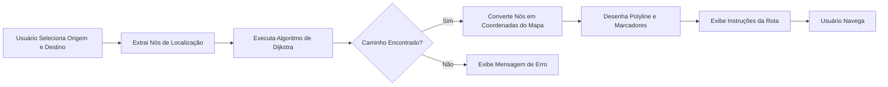

# Mapa Indoor - Mapa de Áreas Internas

Um sistema interativo de navegação em ambientes fechados para shopping centers e outras instalações. O projeto utiliza plantas baixas, algoritmos de busca de caminho baseados em grafos e visualização de rotas.


---

## Visão Geral

**Mapa Indoor** é um sistema interativo que combina:

- **Visualização de Plantas Baixas**: Usa Leaflet.js com sistema de coordenadas customizado para mapeamento de plantas
- **Busca de Caminhos Inteligente**: Implementa o algoritmo de Dijkstra para encontrar rotas ótimas entre locais
- **Pontos de Interesse Interativos**: Lojas e facilidades clicáveis com pop-ups informativos
- **Desenho de Rotas**: Visualiza o caminho calculado no mapa com orientações
- **Design Responsivo**: Layout amigável para totens


### Casos de Uso
- Navegação em shopping centers
- Orientação em aeroportos
- Navegação em hospitais ou grandes instalações
- Orientação em centros de exposição
- Navegação em eventos e espaços

---

### Coordenadas

O projeto converte entre dois sistemas de coordenadas:

```javascript
// Coordenadas de imagem (coordenadas padrão de pixels)
// Origem (0,0) no canto superior esquerdo, X aumenta para direita, Y para baixo
toLeafletPoint(x, y) → [MAP_H - y, x]

// Coordenadas do Leaflet (eixo Y invertido)
// Usado internamente pelo Leaflet para renderização apropriada
```

#### **Grafo de Navegação**
- **nodes**: Pontos estratégicos incluindo corredores, portas e destinos
- **links**: Conexões representando caminhos percorríveis
- **pesos**: Distâncias euclidianas entre nós (não informado no projeto, é inferido pelas coordenadas)

#### **Pontos de Interesse (POIs)**
```
- 3 Entradas
- Cinema
- Academia
- Supermercado
- Sala de Jogos
- Loja de Moda
- Recepção
```

---

## Fundamentos Matemáticos

### Algoritmo de Dijkstra

O algoritmo central de busca de caminho usa o **Algoritmo de Dijkstra para o Caminho Mais Curto**, um algoritmo que encontra o caminho mais curto entre dois nós em um grafo.

#### Análise de Complexidade

- **Complexidade de Tempo**: O((V + E) log V) com heap binária
  - V = número de nós (vértices)
  - E = número de arestas
  
- **Complexidade de Espaço**: O(V)
  - Para armazenar distâncias e nós anteriores

#### Base Matemática

Para cada aresta conectando nós A e B, a distância é calculada como:

$$d(A, B) = \sqrt{(x_A - x_B)^2 + (y_A - y_B)^2}$$

Esta é a fórmula de **distância euclidiana**, garantindo distâncias de caminho realistas na planta.

### Representação em Grafo

O grafo de navegação é representado como uma lista de adjacência:

```javascript
graph = {
  nóA: { nóB: distância, nóC: distância, ... },
  nóB: { nóA: distância, nóD: distância, ... },
  ...
}
```

Esta representação bidirecional permite travessia em ambas as direções em corredores.

---

## Diagrama de Fluxo de Dados



## Stack

| Tecnologia | Propósito |
|-----------|----------|
| **Leaflet.js v1.9.4** | Biblioteca interativa de mapa |
| **CRS.Simple** | Sistema de referência de coordenadas customizado |


### Instalação

1. **Clone ou baixe o projeto**
   ```bash
   git clone git@github.com:guilhermednztt/indoor-map.git
   cd mapa-indoor
   ```

2. **Rode localmente** (necessário para funcionamento apropriado)
   ```bash
   # Usando Python 3
   python -m http.server 8000
   ```

3. **Abra no navegador**
   ```
   http://localhost:8000
   ```

---

## Configuração

### Dimensões do Mapa
Edite estas constantes em `scripts/index.js`:
```javascript
const MAP_W = 2000;  // Largura da imagem em pixels
const MAP_H = 1400;  // Altura da imagem em pixels
```

### Adicionar Novos Locais

1. **Defina Coordenadas dos Nós** no objeto `nodes`:
   ```javascript
   idNó: { x: pixelX, y: pixelY }
   ```

2. **Crie Localização** no objeto `locations`:
   ```javascript
   locationId: {
     label: "Nome de Exibição",
     node: "idNó"
   }
   ```

3. **Conecte no Grafo** via array `links`:
   ```javascript
   ["nóA", "nóB"]  // Define caminho percorrível
   ```

### Adicionando Novas Salas/Lojas

Defina no array `rooms`:
```javascript
{
  name: "Nome da Loja",
  code: "CÓDIGO",
  color: "#1a73e8",
  category: "Categoria",
  polygon: [[x1, y1], [x2, y2], [x3, y3], [x4, y4]]
}
```

## Exemplo: Adicionar Novo Local

```javascript
// 1. Adicione nó no objeto nodes
const nodes = {
  // ... nós existentes
  entrada_loja: { x: 800, y: 600 }
};

// 2. Adicione conexão no array links
const links = [

<!-- Fallback em HTML para visualizadores que não renderizam Markdown -->

  // ... links existentes
  ["nó_corredor", "entrada_loja"]
];

// 3. Adicione localização no objeto locations
const locations = {
  // ... localizações existentes
  nova_loja: {
    label: "Minha Nova Loja",
    node: "entrada_loja"
  }
};

// 4. O sistema automaticamente:
//    - Adiciona ao grafo de busca de caminho
//    - Torna disponível nos dropdowns
//    - Cria um marcador clicável
```

## Explicação do Sistema de Coordenadas do Mapa

### O Desafio
Plantas baixas são imagens com coordenadas de pixels, mas Leaflet usa latitude/longitude. A solução: **CRS.Simple** - um sistema de referência de coordenadas que trata posições de pixels como coordenadas.

### Transformação de Coordenadas

**Espaço de Imagem** → **Espaço do Leaflet**
```
toLeafletPoint(x, y):
  leafletY = MAP_HEIGHT - y  (eixo Y é invertido)
  leafletX = x
  retorna [leafletY, leafletX]
```

---

## Referências

- [Documentação do Leaflet.js](https://leafletjs.com/)
- [Algoritmo de Dijkstra](https://www.w3schools.com/dsa/dsa_algo_graphs_dijkstra.php)

